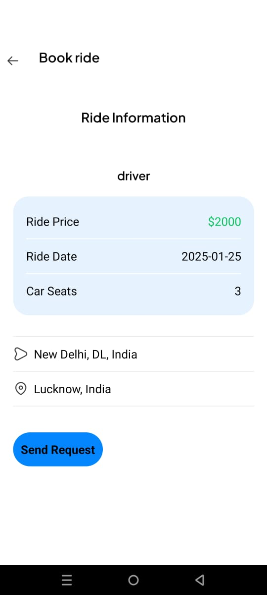
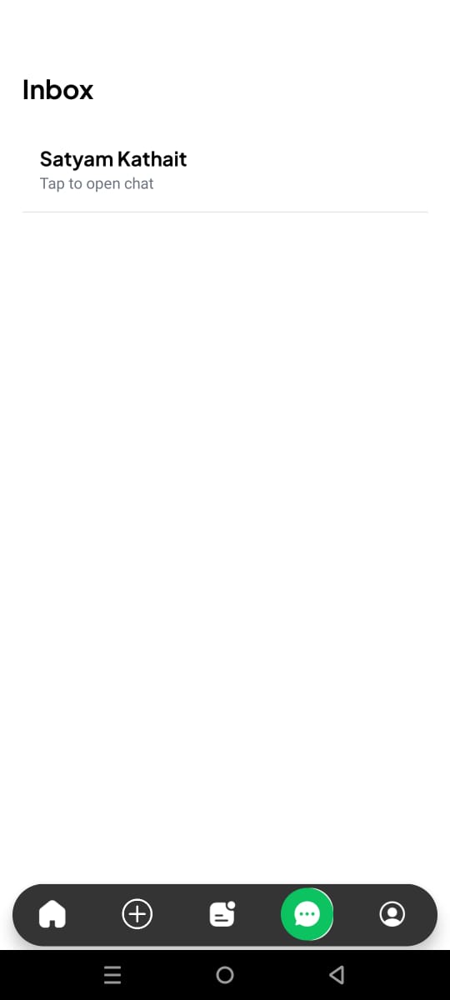
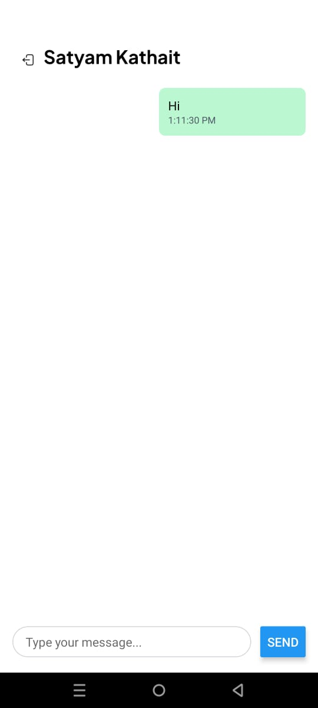

# Ride Sharing App

Welcome to the Ride Sharing App! This mobile application is designed to connect riders with drivers seamlessly, making commuting easier, faster, and more efficient. Built using **React Native** and styled with **NativeWind**, the app leverages modern technology to provide a reliable and user-friendly experience for both passengers and drivers.

## Features

### For Riders
- **Quick Ride Booking**: Request a ride in just a few taps.
- **Real-Time Tracking**: Track your driver’s location in real time.
- **Fare Estimation**: Get an estimate of your ride cost before booking.
- **Ride History**: View your previous rides and receipts.

### For Drivers
- **Ride Requests**: Accept or decline ride requests with ease.
- **Navigation Assistance**: Built-in maps and directions for efficient routing.
- **Earnings Dashboard**: Monitor your earnings and completed rides.

## Technology Stack

- **Frontend**: React Native
- **Styling**: NativeWind (Tailwind CSS for React Native)
- **Backend**: Node.js with Express.js
- **Database**: Supabase
- **Real-Time Updates**: Supabase

## Getting Started

### Prerequisites
Ensure you have the following installed:
- Node.js
- React Native CLI or Expo CLI
- Supabase

### Installation

1. Clone the repository:
   ```bash
   git clone https://github.com/yourusername/ride-sharing-app.git
   cd ride-sharing-app
   ```
2. Install dependencies:
   ```bash
   npm install
   ```
3. Set up your environment variables in a `.env` file:
   ```env
   MONGO_URI=your_mongodb_connection_string
   API_KEY=your_api_key
   ```
4. Start the development server:
   ```bash
   npm run start
   ```

## Screenshots

| **Sign In Interface**  |
|:-----------------------:|
|  |

| **Find Ride Interface** | **Publish Ride Interface** |
|:------------------------:|:---------------------------:|
|  |  |

| **Ride Request Interface** | **Ride Screen** | **Published Ride Card** |
|:---------------------------:|:---------------:|:-----------------------:|
|  |  |  |

| **Inbox** | **Empty Inbox** | **Chat** |
|:---------:|:---------------:|:-------:|
|  |  |  |


## Contributing

Contributions are welcome! If you’d like to contribute:
1. Fork the repository.
2. Create a new branch for your feature:
   ```bash
   git checkout -b feature-name
   ```
3. Commit your changes:
   ```bash
   git commit -m "Add feature description"
   ```
4. Push to the branch:
   ```bash
   git push origin feature-name
   ```
5. Open a pull request.

## License

This project is licensed under the MIT License. See the [LICENSE](LICENSE) file for details.

## Contact

If you have any questions, feel free to reach out:
- **Name**: Satyam Kathait
- **Email**: [your-email@example.com](mailto:your-email@example.com)
- **LinkedIn**: [Your LinkedIn Profile](https://www.linkedin.com/in/yourprofile)

---

Thank you for checking out the Ride Sharing App! We hope it simplifies your travel experience.

